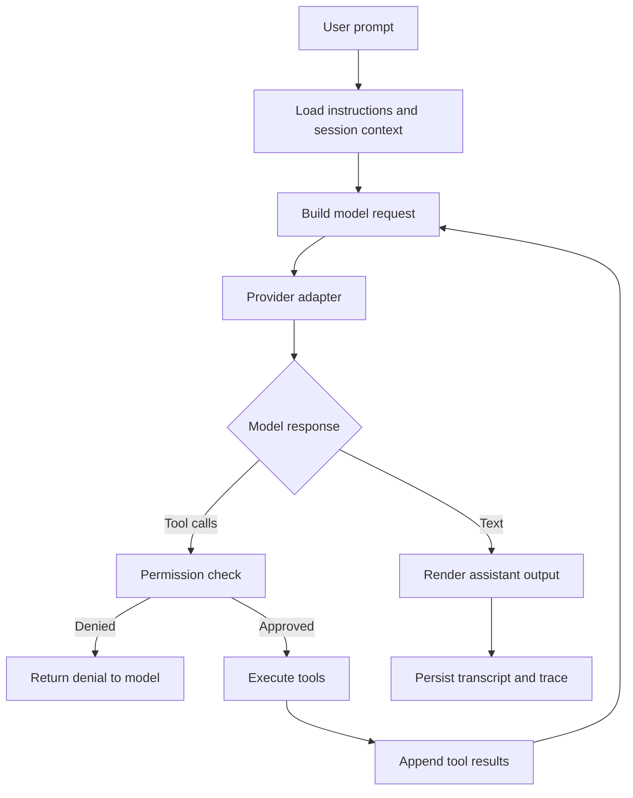

# Herox Agent CLI 需求文档

## 1. 产品定位

Herox 是一个面向开发者的终端智能体 CLI，核心命令为 `herox`，npm 包名为 `@heroor/x`。它参考 Claude Code 的交互形态和扩展能力，但模型层不绑定单一供应商，优先兼容 OpenAI Chat Completions 风格 API，并通过适配器支持国内外主流大模型服务。

Herox 的目标不是做一个简单聊天 CLI，而是做一个可审计、可扩展、可分发的本地开发智能体运行时：

- 能理解项目上下文，执行文件、Shell、Git、MCP 等工具调用。
- 能通过 Tools、MCP、Skills、Plugins、Subagents 组合复杂工作流。
- 能在个人、项目、团队三个层面管理配置、权限和扩展。
- 能以 npm 包形式安装、升级和发布，降低用户使用门槛。

## 2. 设计原则

- Provider agnostic：模型供应商只通过适配器接入，核心 Agent Loop 不依赖具体厂商。
- Local-first：项目文件、会话、配置和扩展默认存放在本机和项目目录中。
- Permission-first：任何写文件、执行命令、联网、调用高风险工具的行为都必须经过权限策略。
- Context-efficient：Skills、Subagents、MCP 工具描述按需加载，避免把所有上下文一次性塞给模型。
- Extensible by default：用户能用普通文件夹、Markdown、JSON 配置扩展 Herox，不必修改核心代码。
- Auditable：工具调用、权限决策、模型请求摘要和配置来源都应可追踪。

## 3. 参考能力

Claude Code 的公开文档中，有几类能力值得 Herox 借鉴：

- 配置层级、环境变量和 `settings.json` 中的 `env` 注入机制。
- MCP 服务器配置、环境变量展开、不同作用域的 MCP server。
- Slash commands 和项目内 Markdown 命令。
- Hooks 在工具调用和会话生命周期中的拦截能力。
- Subagents 的独立上下文、专属 system prompt、工具限制和权限模式。
- Plugins 将 skills、agents、hooks、MCP servers 等组件打包分发。
- 项目记忆文件，例如 `CLAUDE.md` 这类约定式项目指令。

Herox 不直接复刻 Claude Code 的内部实现。Herox 应抽象出自己的配置目录、权限模型、包命名和插件协议，同时保留用户已经熟悉的 Agent CLI 使用方式。

参考资料：

- Claude Code settings: https://code.claude.com/docs/en/settings
- Claude Code MCP: https://docs.anthropic.com/en/docs/claude-code/mcp
- Claude Code hooks: https://code.claude.com/docs/en/hooks
- Claude Code subagents: https://code.claude.com/docs/en/sub-agents
- Claude Code plugins: https://code.claude.com/docs/en/plugins
- Claude Code memory: https://code.claude.com/docs/en/memory
- OpenAI Chat Completions: https://platform.openai.com/docs/api-reference/chat/create-chat-completion
- OpenAI function calling: https://platform.openai.com/docs/guides/function-calling

## 4. 用户画像与核心场景

### 4.1 用户画像

- 个人开发者：希望在终端内让 AI 阅读、修改、测试项目。
- 团队工程师：希望把团队编码规范、常用 MCP、工具权限和工作流沉淀到项目中。
- AI 工具开发者：希望为 Agent CLI 开发插件、工具、技能或子智能体。
- 国内模型用户：需要使用 DeepSeek、Qwen、Kimi、GLM、SiliconFlow、OpenRouter 等兼容 OpenAI 风格接口的服务。

### 4.2 核心场景

- 在项目根目录运行 `herox`，进入交互式 Agent 会话。
- 使用 `herox run "修复测试失败"` 执行一次性任务。
- 用 `HEROX.md` 维护项目级指令和团队规范。
- 配置多个 provider，在不同任务中切换模型。
- 通过 MCP 接入 GitHub、浏览器、数据库、设计稿、内部系统。
- 通过 Skills 固化重复工作流，例如代码审查、发布检查、接口生成。
- 通过 Plugins 分发组织内标准工具链。
- 通过 Subagents 并行执行调研、测试、审查等上下文隔离任务。

## 5. 安装与命令入口

### 5.1 安装

```bash
npm install -g @heroor/x
herox --version
```

可选短命令：

```bash
hx
```

`hx` 作为 bin alias 存在命名冲突风险，MVP 可先只发布 `herox`，在确认 npm 包生态和用户反馈后再开放。

### 5.2 CLI 命令

```bash
herox                         # 进入交互会话
herox run "task"              # 执行一次性任务
herox init                    # 初始化 .herox/ 与 HEROX.md
herox resume [session-id]     # 恢复历史会话
herox config get [key]        # 查看有效配置
herox config set key value    # 写入用户或项目配置
herox provider list           # 查看 provider preset
herox provider test <name>    # 测试模型连接
herox mcp list                # 查看 MCP server
herox mcp add <name>          # 添加 MCP server
herox skill list              # 查看 skills
herox skill run <name>        # 显式运行 skill
herox plugin list             # 查看 plugins
herox plugin add <source>     # 安装 plugin
herox agent list              # 查看 subagents
herox doctor                  # 诊断环境、配置和权限
```

### 5.3 交互命令

交互会话支持 slash commands：

```text
/help
/model
/provider
/config
/mcp
/skills
/plugins
/agents
/permissions
/status
/compact
/resume
/exit
```

项目可通过 `.herox/commands/*.md` 增加自定义命令。Plugin 也可贡献命令，但命名应带插件前缀，例如 `/team-release:check`，避免冲突。

## 6. 模型与 Provider

### 6.1 基础策略

MVP 以 OpenAI Chat Completions 风格 API 为主，因为它是当前多数国内外模型服务提供兼容层时最常见的协议形态。Herox 内部定义统一的 `ModelProvider` 接口，屏蔽不同供应商的 base URL、鉴权头、流式输出、tool call 差异和模型能力声明。

OpenAI Responses API 可作为后续增强接口接入，但不应作为 MVP 唯一路径，因为大量兼容供应商仍主要兼容 `/v1/chat/completions`。

### 6.2 Provider preset

MVP 建议内置以下 preset，所有 preset 都允许用户覆盖 `baseURL`、`apiKeyEnv`、`headers` 和默认模型：

- `openai`
- `azure-openai`
- `deepseek`
- `qwen`
- `moonshot`
- `zhipu`
- `siliconflow`
- `openrouter`
- `groq`
- `mistral`
- `together`
- `fireworks`
- `ollama`
- `lmstudio`
- `vllm`

对 API 不完全兼容的供应商，preset 必须显式标记 `compatibility: "partial"`，并在 `herox doctor` 中提示可能缺失的能力，例如 tool calls、vision、JSON mode 或 reasoning 参数。

### 6.3 能力矩阵

每个模型需要声明能力，避免 Agent Loop 盲目使用不支持的功能：

```json
{
  "provider": "deepseek",
  "model": "deepseek-v4-pro",
  "capabilities": {
    "streaming": true,
    "toolCalls": true,
    "parallelToolCalls": false,
    "vision": false,
    "jsonMode": true,
    "reasoning": false,
    "maxInputTokens": 64000,
    "maxOutputTokens": 8192
  }
}
```

### 6.4 Provider 配置示例

```json
{
  "model": {
    "provider": "deepseek",
    "name": "deepseek-v4-pro",
    "temperature": 0.2,
    "maxOutputTokens": 8192
  },
  "providers": {
    "deepseek": {
      "baseURL": "https://api.deepseek.com",
      "apiKeyEnv": "DEEPSEEK_API_KEY"
    },
    "openrouter": {
      "baseURL": "https://openrouter.ai/api/v1",
      "apiKeyEnv": "OPENROUTER_API_KEY",
      "headers": {
        "HTTP-Referer": "https://github.com/heroor/herox",
        "X-Title": "Herox"
      }
    }
  }
}
```

## 7. 配置系统

### 7.1 配置文件位置

```text
~/.herox/settings.json              # 用户级配置
~/.herox/skills/                    # 用户级 skills
~/.herox/plugins/                   # 用户级 plugins
~/.herox/sessions/                  # 用户级会话记录

<repo>/HEROX.md                     # 项目级自然语言指令
<repo>/.herox/settings.json         # 项目共享配置，可提交
<repo>/.herox/settings.local.json   # 本地私有配置，不提交
<repo>/.herox/mcp.json              # 项目 MCP 配置，可提交但不能包含密钥
<repo>/.herox/skills/               # 项目级 skills
<repo>/.herox/agents/               # 项目级 subagents
<repo>/.herox/commands/             # 项目级 slash commands
```

### 7.2 配置优先级

有效配置按以下顺序合并：

```text
defaults
-> user settings
-> project settings
-> project local settings
-> environment variables
-> CLI flags
-> managed policy enforcement
```

`managed policy enforcement` 用于企业或团队策略，主要负责强制禁用、强制允许或覆盖敏感项。例如禁止 `bypassPermissions`，禁止读取某些路径，或固定审计日志目录。

### 7.3 环境变量

Herox 需要支持两类环境变量：

- Herox 自身行为变量：`HEROX_CONFIG_DIR`、`HEROX_MODEL`、`HEROX_PROVIDER`、`HEROX_PERMISSION_MODE`。
- Provider 密钥变量：`OPENAI_API_KEY`、`DEEPSEEK_API_KEY`、`QWEN_API_KEY` 等。

项目配置中的 `env` 会注入每个会话，但不应把密钥写入可提交文件：

```json
{
  "env": {
    "NODE_ENV": "development",
    "HEROX_MAX_TOOL_OUTPUT_CHARS": "30000"
  }
}
```

`.herox/settings.local.json` 可以引用本机路径和私有环境变量，但默认应加入 `.gitignore`。

## 8. Agent Loop

### 8.1 主流程



### 8.2 核心要求

- 支持流式输出，用户能看到模型逐步响应。
- 支持多轮 tool call，直到模型停止或达到限制。
- 支持最大步数、最大 token、最大工具输出字符数限制。
- 支持中断：用户按 Ctrl+C 时能取消模型请求或正在运行的工具。
- 支持恢复：会话 transcript 可持久化并通过 `herox resume` 恢复。
- 支持摘要压缩：上下文接近模型上限时触发 `/compact` 或自动摘要。

## 9. Tools

### 9.1 Tool registry

Herox 内部所有工具都注册为统一结构：

```ts
interface ToolDefinition {
  name: string
  description: string
  inputSchema: JsonSchema
  risk: "read" | "write" | "execute" | "network" | "destructive"
  execute(input: unknown, context: ToolContext): Promise<ToolResult>
}
```

工具描述必须尽量短，避免把实现细节塞进模型上下文。复杂工具应通过 `risk`、`permissions` 和运行时错误提示约束行为。

### 9.2 MVP 内置工具

- `fs.read`：读取文件。
- `fs.list`：列目录。
- `fs.search`：基于 ripgrep 搜索文本。
- `fs.write`：写新文件或覆盖文件，默认需要确认。
- `fs.patch`：应用结构化 patch，优先用于代码修改。
- `shell.exec`：执行命令，默认需要确认。
- `git.status`、`git.diff`、`git.log`：只读 Git 工具。
- `git.apply`：应用 patch，默认需要确认。
- `task.update`：更新任务计划或 TODO 状态。

### 9.3 权限模式

```text
plan          # 只读探索，不允许写入和执行高风险命令
default       # 读操作自动允许，写入/执行需要确认
acceptEdits   # 工作区内文件编辑自动允许，Shell 仍需确认
auto          # 根据 allow/deny 规则和风险分类自动决策
bypass        # 跳过大多数确认，默认只允许显式开启
```

MVP 默认使用 `default`。`bypass` 不应通过项目共享配置开启，只能由用户 CLI flag 或本地私有配置开启。

### 9.4 权限规则

```json
{
  "permissions": {
    "mode": "default",
    "allowTools": ["fs.read", "fs.search", "git.status"],
    "denyTools": ["shell.exec:rm", "shell.exec:git push"],
    "allowedDirectories": ["."],
    "deniedDirectories": [".git", "node_modules", ".env"]
  }
}
```

权限匹配需要支持：

- 工具名级别：`fs.read`。
- 工具入参级别：`shell.exec:pnpm test`。
- 路径级别：工作区、额外目录、敏感目录。
- 会话级临时授权：本轮允许、整个会话允许、永久允许。

## 10. MCP

### 10.1 支持范围

Herox 作为 MCP client，支持：

- `stdio` server。
- `http` server。
- `sse` server。
- tools。
- resources。
- prompts。

MVP 可以先完成 `stdio` 和 tools，再扩展 HTTP/SSE、resources 和 prompts。

### 10.2 配置示例

```json
{
  "mcpServers": {
    "filesystem": {
      "type": "stdio",
      "command": "npx",
      "args": ["-y", "@modelcontextprotocol/server-filesystem", "${workspaceFolder}"],
      "env": {
        "DEBUG": "false"
      }
    }
  }
}
```

### 10.3 MCP 要求

- 支持 `${workspaceFolder}`、`${env:NAME}` 变量展开。
- 支持用户级、项目级、插件级 MCP server 合并。
- 支持禁用项目 `.herox/mcp.json` 中的指定 server。
- MCP tool 名称必须 namespaced，例如 `mcp.filesystem.read_file`。
- MCP server 连接失败不应导致整个 Herox 启动失败，除非该 server 被标记为 required。
- MCP tool 权限需要接入统一 permission engine。

## 11. Skills

### 11.1 Skill 形态

Skill 是可复用的 Markdown 工作流，适合沉淀“如何做某类任务”。Skill 不等同于工具，它主要给 Agent 注入策略、步骤、约束和少量示例。

目录结构：

```text
.herox/skills/code-review/SKILL.md
.herox/skills/release-check/SKILL.md
```

示例：

```markdown
---
name: code-review
description: Review code changes and report correctness risks first.
allowedTools:
  - fs.read
  - fs.search
  - git.diff
---

Use a code-review stance. Findings must include file and line references.
```

### 11.2 Skill 加载策略

- 启动时只加载 skill metadata。
- 模型需要或用户显式调用时再加载完整 `SKILL.md`。
- Skill 可以声明推荐工具，但不能绕过全局权限。
- Skill 可以由用户、项目或插件提供。冲突时使用 scope 前缀区分。

## 12. Plugins

### 12.1 Plugin 目标

Plugin 用于分发一组可复用扩展，包含 commands、skills、agents、hooks、MCP servers 和本地 tools。Plugin 面向团队和社区共享，区别于项目内 `.herox/` 的临时配置。

### 12.2 Plugin 目录

```text
my-plugin/
  .herox-plugin/
    plugin.json
  commands/
  skills/
  agents/
  hooks/
  tools/
  mcp.json
```

`plugin.json` 示例：

```json
{
  "name": "team-release",
  "version": "0.1.0",
  "description": "Release workflows for the team",
  "components": {
    "commands": "commands",
    "skills": "skills",
    "agents": "agents",
    "hooks": "hooks",
    "tools": "tools",
    "mcp": "mcp.json"
  }
}
```

### 12.3 Plugin 安装来源

MVP 支持：

- 本地路径：`herox plugin add ./my-plugin`。
- Git URL：`herox plugin add github:org/repo/path`。
- npm 包：`herox plugin add @scope/herox-plugin-name`。

Plugin 启用后，所有组件必须带命名空间，例如：

```text
/team-release:check
team-release:release-check
team-release:security-reviewer
```

## 13. Subagents

### 13.1 Subagent 目标

Subagent 用于隔离上下文、工具权限和系统提示。适合执行测试日志分析、代码审查、文档调研、依赖扫描等会产生大量中间上下文但只需要返回摘要的任务。

### 13.2 Agent 文件

```markdown
---
name: code-reviewer
description: Use proactively after code changes to find correctness risks.
provider: deepseek
model: deepseek-v4-pro
permissionMode: plan
tools:
  - fs.read
  - fs.search
  - git.diff
skills:
  - code-review
mcpServers:
  - github
---

You are a strict code reviewer. Report bugs first, then test gaps.
```

### 13.3 运行规则

- 非 fork subagent 默认使用全新上下文。
- 主会话负责任务拆解，并把任务摘要传给 subagent。
- Subagent 返回结构化结果，不直接污染主会话上下文。
- Subagent 可以限制 provider、model、tools、skills、MCP servers 和 permission mode。
- Background subagent 在 MVP 可以先不实现；v1.0 再提供并发执行和结果汇总。
- 默认不允许 subagent 再创建 subagent，避免调度和权限复杂度失控。

## 14. Hooks

### 14.1 事件

MVP 支持以下事件：

```text
SessionStart
SessionEnd
UserPromptSubmit
PreToolUse
PostToolUse
ToolError
SubagentStart
SubagentStop
BeforeCompact
AfterCompact
```

### 14.2 Hook 类型

- `command`：执行本地命令。
- `http`：POST 到指定 endpoint。
- `prompt`：让当前模型执行检查。
- `tool`：调用 Herox tool 或 MCP tool。

### 14.3 安全要求

- Hook 默认继承当前 permission mode。
- `PreToolUse` 可以阻止工具调用或要求人工确认。
- Hook 输出必须限制大小并做敏感信息脱敏。
- 项目共享 hook 首次执行前必须提示用户确认。

## 15. Memory 与项目指令

### 15.1 项目指令

Herox 使用 `HEROX.md` 作为项目级自然语言指令文件：

```markdown
# Herox Instructions

- Use pnpm.
- Run tests before finalizing code changes.
- Do not edit generated files.
```

启动时加载：

```text
~/.herox/HEROX.md
<repo>/HEROX.md
<repo>/.herox/HEROX.local.md
```

### 15.2 自动记忆

自动记忆作为 v1.0 后能力，不纳入 MVP 必需范围。原因是自动写入长期记忆容易引入隐私、错误沉淀和跨项目污染。MVP 先支持显式 `/memory add` 和 `/memory list`。

## 16. 会话与审计

每个会话保存：

- prompt 和 assistant response。
- 模型 provider、model、参数摘要。
- 工具调用名称、入参摘要、结果摘要。
- 权限请求、用户决策和规则来源。
- 错误、重试和中断信息。

默认存储路径：

```text
~/.herox/sessions/<repo-hash>/<session-id>.jsonl
```

敏感信息策略：

- API key、token、Authorization header 必须脱敏。
- `.env` 文件内容默认不写入 transcript。
- 用户可通过配置关闭持久化或只保存摘要。

## 17. 非功能需求

- Runtime：Node.js 20+。
- Language：TypeScript, ESM。
- Package manager：pnpm。
- Supported OS：macOS、Linux、Windows。
- Startup：冷启动目标小于 1.5 秒，不连接 MCP 的情况下小于 800ms。
- Test：核心包单元测试覆盖率目标 80% 以上；工具执行、权限、provider adapter 必须有回归测试。
- Logging：默认人类可读，`--json` 输出机器可读事件流。
- Accessibility：终端输出不能依赖颜色表达唯一语义。
- Offline behavior：无网络时仍可阅读项目、运行本地工具和使用本地模型 provider。

## 18. npm 发布策略

MVP 先发布纯 TypeScript/Node.js npm 包，不引入 postinstall 二进制链接，也不拆平台 optional dependencies。这样能降低首发复杂度，避免安装脚本带来的供应链风险和跨平台失败。

MVP 包形态：

```json
{
  "name": "@heroor/x",
  "type": "module",
  "bin": {
    "herox": "./dist/index.js"
  },
  "engines": {
    "node": ">=20"
  },
  "files": ["dist", "README.md", "LICENSE"]
}
```

发布要求：

- 使用 GitHub Actions trusted publishing 和 npm provenance。
- 使用 `files` 白名单控制发布内容。
- 发布前必须运行 `npm pack --dry-run` 或等效检查，确认不包含 source map、测试 fixture、密钥、内部配置和未编译源码。
- 不使用 `postinstall` 修改用户目录、注入 commands、skills 或 hooks。
- CLI 入口只做命令分发和运行时初始化，不在安装阶段执行副作用。

后期迁移到 Bun 生态和原生二进制时，再采用 wrapper 包加平台包的结构：

```text
@heroor/x                      # 主包，暴露 herox 命令
@heroor/x-darwin-arm64         # macOS Apple Silicon 二进制
@heroor/x-darwin-x64           # macOS Intel 二进制
@heroor/x-linux-x64            # Linux glibc x64 二进制
@heroor/x-linux-x64-musl       # Linux musl x64 二进制
@heroor/x-linux-arm64          # Linux ARM64 二进制
@heroor/x-win32-x64            # Windows x64 二进制
```

迁移时优先选择 JS shim 运行时解析平台包并 spawn 原生二进制，避免必须依赖 postinstall。只有在确实需要复制或链接二进制时，才增加 postinstall，并提供明确的 `--ignore-scripts` 失败提示和手动修复命令。

## 19. MVP 范围

MVP 必须包含：

- npm 包 `@heroor/x` 和 `herox` bin。
- 首发包为纯 Node.js CLI，不包含原生二进制发布链路。
- 交互式会话和 `herox run`。
- OpenAI-compatible Chat Completions provider adapter。
- Provider preset：`openai`、`deepseek`、`qwen`、`moonshot`、`openrouter`、`ollama`。
- 配置系统：用户级、项目级、本地级、env、CLI flag。
- `HEROX.md` 项目指令。
- 内置文件、搜索、patch、shell、git 只读工具。
- Permission engine。
- 会话保存和恢复。
- MCP stdio tools。
- Skills metadata discovery 和按需加载。
- 基础 subagent foreground 执行。
- `doctor` 诊断命令。

MVP 不包含：

- 插件 marketplace。
- 后台 subagents。
- 自动长期记忆。
- Web UI。
- 企业 managed policy 完整实现。
- 原生 IDE 插件。
- Bun 编译二进制和平台 optional dependency 包。

## 20. v1.0 范围

v1.0 在 MVP 基础上补齐：

- Plugin 系统和本地/Git/npm 安装。
- MCP HTTP/SSE、resources、prompts。
- Background subagents 和并发任务汇总。
- Hooks command/http/prompt/tool。
- Slash command 自定义。
- JSON 事件流和更完整审计日志。
- Provider 能力矩阵自动检测。
- npm 自动发布、变更日志和升级提示。
- Bun 构建实验链路和原生二进制发布预研。

## 21. 风险与约束

- OpenAI-compatible 并不代表完全兼容。不同供应商在 streaming、tool calls、错误格式和参数名上会有差异，必须用 provider capabilities 管控。
- Shell 工具是最大安全风险。默认策略必须保守，任何 destructive 命令都需要明确确认。
- Plugin 和 MCP 都是第三方代码入口。必须提供来源提示、权限隔离和禁用能力。
- Subagents 会增加 token 成本和调度复杂度。MVP 应先做 foreground、单层级、结构化返回。
- 国内模型上下文长度、工具调用质量和 JSON 稳定性差异较大，需要把“模型能力不足”设计成可诊断状态，而不是 Agent 静默失败。
- npm install scripts 是供应链高风险面。Herox MVP 不应使用 postinstall；后续若引入二进制安装脚本，需要独立安全审查。
